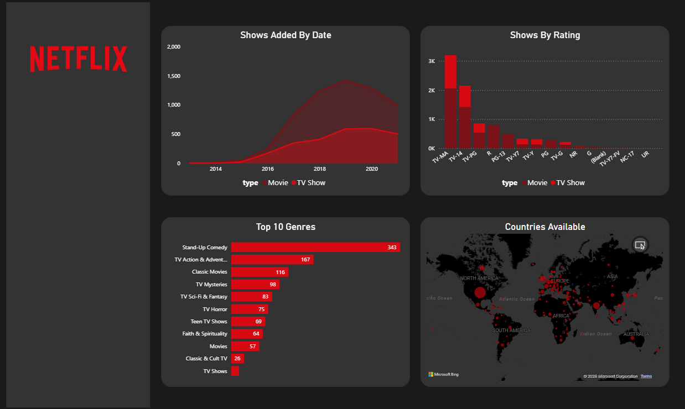
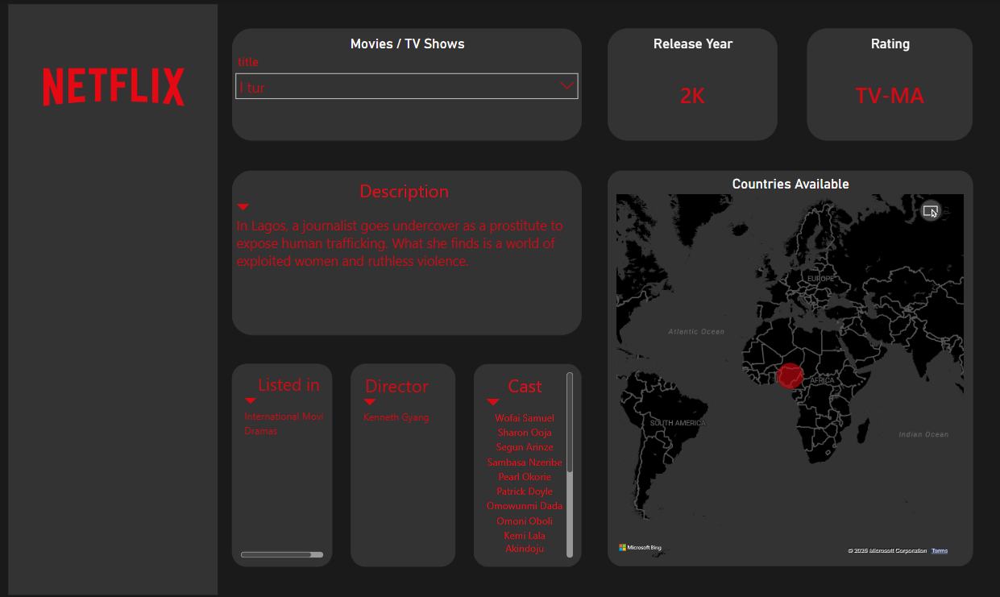

# Netflix Power BI Dashboard

## Project Overview

This project is an interactive Netflix Content Analytics Dashboard built using Power BI. The dashboard provides insights into Netflix titles, ratings, genres, release trends, and country-wise availability.

## Tools Used

- Power BI
- Power Query
- Data Visualization

## Dashboard Features

### Overview Dashboard
- Content growth over time
- Rating distribution analysis
- Top genres analysis
- Country-wise content availability map
- Interactive filtering

### Single Title View
- Movie/TV Show selection
- Release year details
- Rating information
- Description view
- Director information
- Cast details
- Country availability map

## Key Insights

- Analyzed Netflix content trends across multiple years.
- Identified most common genres and ratings.
- Visualized global content distribution using map visualizations.
- Created drill-through pages for title-level analysis.

## Screenshots

### Overview Dashboard

### Single Title View

## Dataset

Netflix Movies and TV Shows Dataset

## Author

Atharva Keluskar
